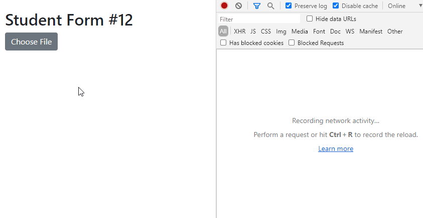
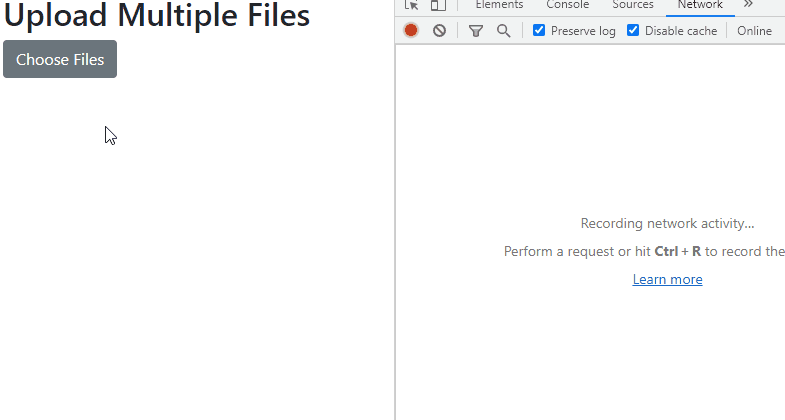

# Upload files from Angular to a .NET API endpoint

## Medium Articles

- [Upload Files with Angular and .NET Web API](https://codeburst.io/upload-files-with-angular-and-net-web-api-77a7966ed226)

  In this article, we will go through details of creating an Angular component for uploading files to a .NET Web API endpoint. The following screen recording shows the demo app.

  

  You are also recommended to read my other article, [File Upload via Swagger](https://codeburst.io/file-upload-via-swagger-e6c21b54d036)

- [Upload Multiple Files with Angular and .NET Web API](https://codeburst.io/uploading-multiple-files-with-angular-and-net-web-api-7560303d9345)

  In this article, we will go through details of creating an Angular component for uploading multiple files to a .NET Web API endpoint. The following screen recording shows the demo app.

  
