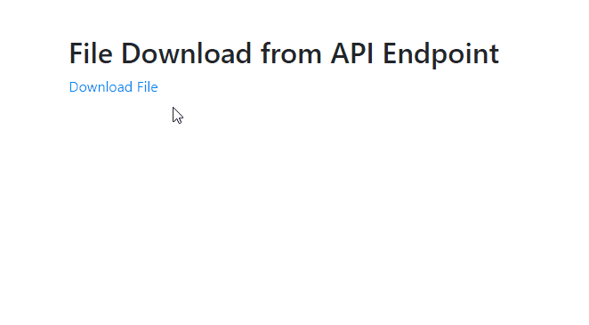

# Upload/Download files with Angular and .NET Web API

In this repository, you can find an Angular SPA, an ASP.NET Core Web API project, and its integration test project, for uploading/downloading files.

## Medium Articles

- [Upload Files with Angular and .NET Web API](https://codeburst.io/upload-files-with-angular-and-net-web-api-77a7966ed226)

  In this article, we will go through details of creating an Angular component for uploading files to a .NET Web API endpoint. The following screen recording shows the demo app.

  

  You are also recommended to read my other article, [File Upload via Swagger](https://codeburst.io/file-upload-via-swagger-e6c21b54d036)

- [Upload Multiple Files with Angular and .NET Web API](https://codeburst.io/uploading-multiple-files-with-angular-and-net-web-api-7560303d9345)

  In this article, we will go through details of creating an Angular component for uploading multiple files to a .NET Web API endpoint. The following screen recording shows the demo app.

  

- [Download Files using Web API](https://codeburst.io/download-files-using-web-api-ae1d1025f0a9)

  In this article, I will use a demo Web API application in ASP.NET Core to show you how to transmit files through an API endpoint. In the final HTML page, end users can left-click a hyperlink to download the file or right-click the link to choose "Save Link As" in the context menu and save the file.

  

## License

Feel free to use the code in this repository as it is under MIT license.

